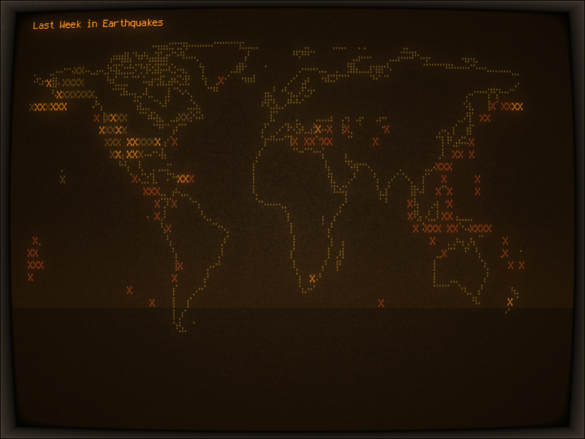

# Lair

This is a cool, retro-looking terminal dashboard that displays the latest earthquakes on a world map, reminiscent of a Bond villain's lair. The earthquakes are color-coded based on their magnitude. Why is it in TypeScript? No good reason.


*This is screenshot was taken in cool-retro-term; batteries not included.*

## Usage

```bash
yarn install
tsx src/map.ts
```

The dashboard will automatically update every minute with the latest earthquake data from the USGS API. You can exit the dashboard by pressing `ESC`, `q`, or `Ctrl+C`.

## Customization

You can customize the appearance of the dashboard by modifying the `earthquakes.ts` script. For example, you can change the colors used for different magnitudes or the character used to represent earthquakes on the map.

## Event Visualizations
Perhaps:
| Category | ASCII Character |
|---|---|
| **Academic** |  ✏️ |
| **School Holidays** |  🏫 |p
| **Public Holidays** |  🏛️ |
| **Observances** |  🕯️ |
| **Politics** |  🏛️ |
| **Conferences** |  🎓 |
| **Expos** |  💡 |
| **Concerts** |  🎤 |
| **Festivals** |  🎊 |
| **Performing Arts** |  🎭 |
| **Sports** |  ⚽️ |
| **Community** |  👨‍👩‍👦‍👦 |
| **Daylight Savings** |  ☀️ |
| **Airport Delays** |  ✈️ |
| **Severe Weather** |  ⛈️ |
| **Disasters** |  💥 |
| **Terror** |  💣 |
| **Health Warnings** |  🩺 |
